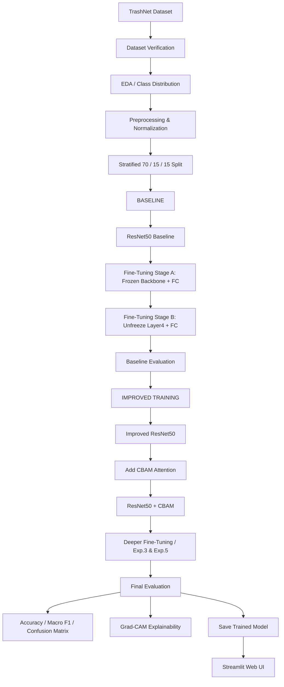

# Project Documentation: Deep Learning-Based Waste Classification for Smart Waste Management

## 1. Project Overview
**Objective:** To automatically classify an input waste image into one of six categories:
- Cardboard
- Glass
- Metal
- Paper
- Plastic
- Trash

This project uses transfer learning with ResNet50, improved training strategies, and **CBAM (Convolutional Block Attention Module)** attention to build the final classifier. The workflow covers everything from the TrashNet dataset through preprocessing, CNN/transfer learning, progressive fine-tuning, evaluation, explainability (Grad-CAM), and Streamlit deployment.

---

## 2. Complete Project Flow

---

## 3. Dataset & Split
The project uses the six-class **TrashNet** resized dataset containing **2,527 images**. 
The split is stratified by class, ensuring the test set is kept entirely separate until the final evaluation.

- **Training:** 70% (1,766 images)
- **Validation:** 15% (377 images)
- **Test:** 15% (384 images)

### Class Distribution (Training Set)
| Class | Train Count |
|---|---|
| Cardboard | 282 |
| Glass | 350 |
| Metal | 287 |
| Paper | 415 |
| Plastic | 337 |
| Trash | 95 |

*Note: The dataset is imbalanced (e.g., 415 Paper vs. 95 Trash). To combat this, **Class-Weighted Cross Entropy** was used during training.*

---

## 4. Image Preprocessing & Augmentation
**Preprocessing for ResNet50:**
- RGB Image
- Resized to 224 × 224
- Tensor Conversion
- ImageNet Normalization (Mean = `[0.485, 0.456, 0.406]`, Std = `[0.229, 0.224, 0.225]`)

**Strong Augmentation Pipeline (Training Only):**
- Random Resized Crop (Scale: 0.70–1.00)
- Random Horizontal Flip
- Random Rotation (±20°)
- Color Jitter (0.30)
- Random Affine (Translation 10%, Scale 0.90–1.10)
- Random Erasing (20%)

---

## 5. Architectural Contribution: CBAM Attention
The final model incorporates **CBAM (Convolutional Block Attention Module)** inserted immediately after ResNet50's `layer4`.

**CBAM consists of:**
1. **Channel Attention:** Adaptive Average Pool & Max Pool -> Shared MLP (Ratio=16) -> Sigmoid. Answers: *Which feature channels are important?*
2. **Spatial Attention:** Channel Average Pool & Max Pool -> Concatenation -> 7x7 Conv -> Sigmoid. Answers: *Where in the image is the important information?*

### Final Architecture
`Image` → `ResNet50 Stem` → `Layer 1-4` → **`CBAM`** → `Adaptive Average Pool` → `Flatten` → `FC (6 classes)`

---

## 6. Training Experiments & Final Results

### Experiment Progression
| Experiment | Model / Method | Best Validation Accuracy | Test Accuracy |
|---|---|---|---|
| Baseline | ResNet50 + Stage A/B Fine-tuning | 90.19% | 89.06% |
| Experiment 1 | Improved ResNet50 + discriminative LR + cosine LR | 92.04% | — |
| Experiment 2 | ResNet50 + strong augmentation | 93.37% | 89.06% |
| **Experiment 3** | **ResNet50 + CBAM (Final Deployed Model)** | **93.37%** | **89.32%** |
| Experiment 4A | ResNet50 + label smoothing | 92.84% | 86.98% |
| Experiment 5 | ResNet50 + CBAM + deeper fine-tuning | 93.10% | 89.32% |

### Final Model Performance (ResNet50 + CBAM)
*Absolute improvement over baseline: **+0.26 percentage points**.*

- **Test Accuracy:** 89.32% (Validation Accuracy was 93.37%)
- **Macro Precision:** 87.89%
- **Macro Recall:** 89.92%
- **Macro F1:** 88.47%
- **Weighted F1:** 89.40%

### Per-Class Final Results
| Class | Precision | Recall | F1 |
|---|---|---|---|
| Cardboard | 98.11% | 85.25% | 91.23% |
| Glass | 88.31% | 89.47% | 88.89% |
| Metal | 90.62% | 93.55% | 92.06% |
| Paper | 89.25% | 92.22% | 90.71% |
| Plastic | 91.04% | 83.56% | 87.14% |
| Trash | 70.00% | 95.45% | 80.77% |

---

## 7. Explainability & UI Deployment
- **Grad-CAM:** Used for explainability to visualize model attention, ensuring the model is activating on the waste object rather than irrelevant background.
- **Streamlit Web UI:** The final application uses `resnet50_cbam_exp3.pth` to provide an interactive user interface. Users can upload an image, and the system performs the `224x224` processing, pushes it through the `ResNet50+CBAM` network, and outputs the predicted category along with the probabilities for all six classes.

---

## 8. Summary for Viva/Presentations

**Methodology Statement:**
> A transfer-learning-based ResNet50 framework is progressively fine-tuned using class-weighted loss, strong augmentation, AdamW optimization and cosine learning-rate scheduling, followed by CBAM attention for enhanced feature representation, with evaluation through classification metrics, confusion matrices and Grad-CAM, and deployment using Streamlit.

**Key Contribution:**
The reference project workflow ends with a standard ResNet50. This project **extends** that architecture by proposing and integrating **CBAM attention** to improve feature selection, alongside comprehensive advanced training strategies (AdamW, discriminative LRs, strong augmentation, and class weighting). The ResNet50-CBAM model achieved **89.32% test accuracy**.
